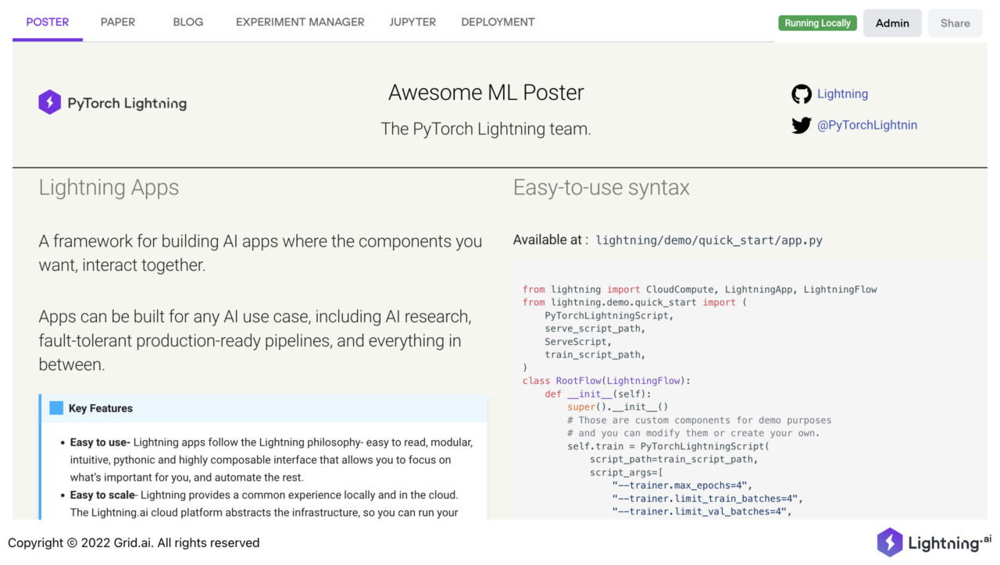

# Lightning Research Poster Template

Use this app to share your research paper results. This app lets you connect a blogpost, arxiv paper, and jupyter
notebook and even have an interactive demo for people to play with the model. This app also allows industry
practitioners to productionize your work by adding inference components (sub 1ms inference time), data pipelines, etc.

Research Poster App helps Authors and Readers to publish and view research, code, experiment reports,
articles or any resource within the same app.

## Getting started

Use this template and customize for your research paper.

### Installation

#### With Lightning

`lightning install app lightning/research_poster`

#### Manual

```
git clone https://github.com/PyTorchLightning/lightning-template-research-app.git
cd lightning-template-research-app
pip install -r requirements.txt
pip install -e .
```

### Share Research with Lightning App

The poster app has a `ResearchApp` class that provides flags that you can use to quickly build an app without knowing
any web development.

#### Highlights

- Provide the link for paper, blog or training log manager like WandB as argument and `ResearchApp` will
  create a tab for each of these.
- Make a poster for your research by editing the markdown file in the [resources](./resources/poster.md) folder.
- Add interactive model demo with Gradio app, update the gradio component present in
  the [research_app](./research_app/components/model_demo.py) folder.
- Launch Jupyter Notebook to show the code demo.

```python
# update app.py at the root of the repo
from lightning import LightningApp

paper = "https://arxiv.org/pdf/2103.00020.pdf"
blog = "https://openai.com/blog/clip/"
github = "https://github.com/mlfoundations/open_clip"
wandb = "https://wandb.ai/aniketmaurya/herbarium-2022/runs/2dvwrme5"

app = LightningApp(
    ResearchApp(
        paper=paper,
        blog=blog,
        experiment_manager=wandb,
        enable_notebook=True,
        enable_gradio=True,
    )
)
```

To run this app, launch the terminal and run `lightning run app app.py`

You should see something like this in your browser:


